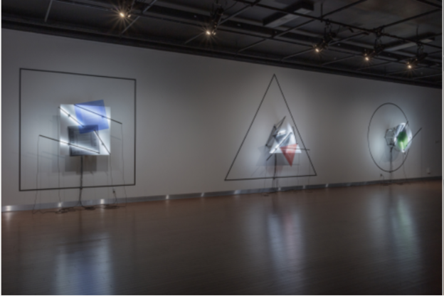
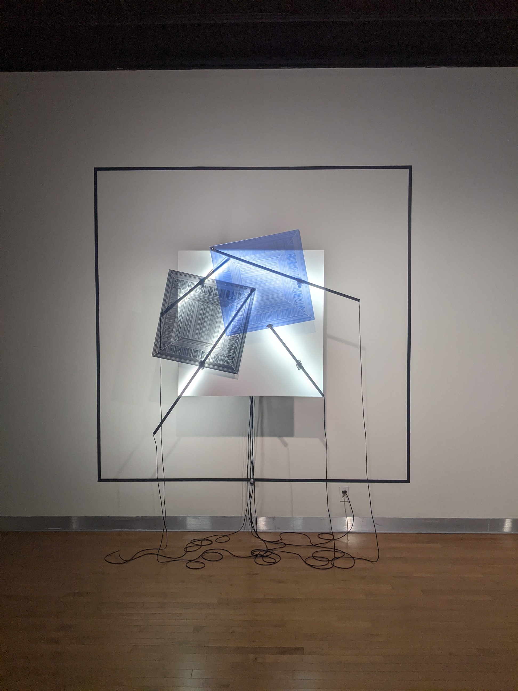
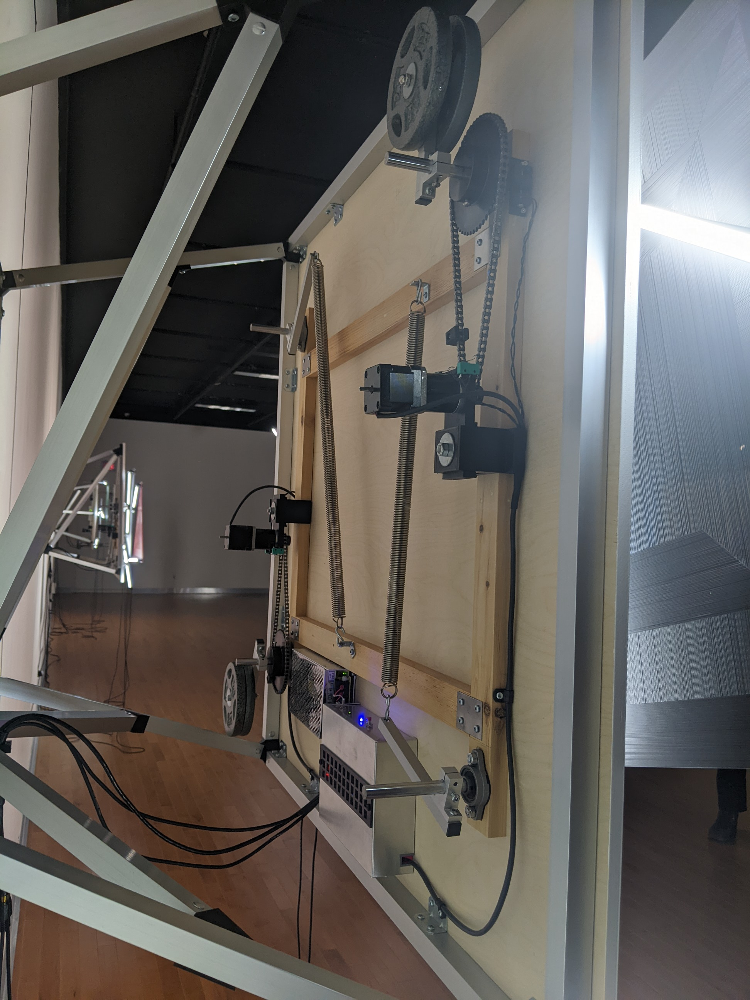

Mécanismes de dessaisissement (rond, carré, triangle)

Catherine Béchard et Sabin Hudon

Triangle et carré 2020 et cercle 2021

Configurations du sensible, 2022

Maison des Arts de Laval

Mars 16 2022

L'oeuvre est divisé en trois parti avec differente forme qui bougent de facon unique. L'oeuvre que je préfére entre les trois qui sont présenter est le carré, car lors de la visite, il avait un effet optique magnifique et très visible contrairement au autre. 

L'oeuvre est composé de deux formes avec plusieurs trous a l'interieur et des lumieres en dessous. Les deux formes bougent lentement pour créé un effet avec la lumiere qui est derière les formes. Il a aussi un mechanisme en arrière de l'oeuvre qui est exposé au publique pour voir comment l'oeuvre fonctionne et comment elle a été produit.

Liste des composantes et techniques de l'oeuvre ou du dispositif (ex. : réalité virtuelle, projecteurs, caméra USB, anneau lumineux...)

Liste des éléments nécessaires pour la mise en exposition (ex. : crochets, sac de sable, câbles de soutien...)

Expérience vécue :

Description de votre expérience de l'oeuvre ou du dispositif, de l'interactivité, des gestes à poser, etc.

Ce qui vous a plu, vous a donné des idées et justifications

Aspect que vous ne souhaiteriez pas retenir pour vos propres créations ou que vous feriez autrement et justifications

Références
