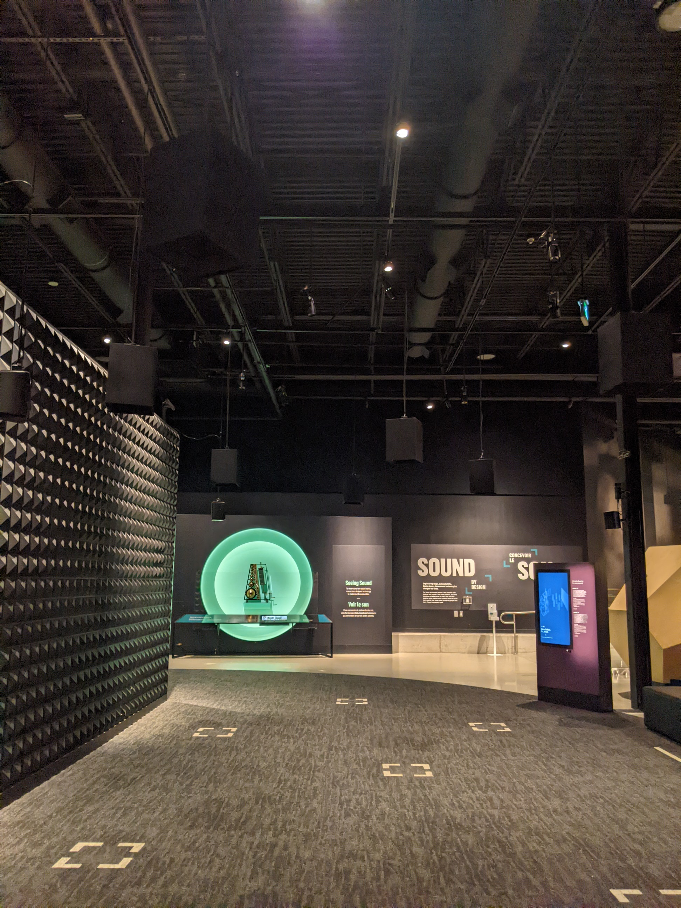

L'oeuvre :  Horizons

Art sonore interactif

Horizons

Créé par Artificiel
Alexandre Burton

2017

Canada Science and Technology Museum

Ottawa, Ontario, Canada

2 Mars, 2022

Photo prise par : David Weitzenfeld 

Novembre 2021

