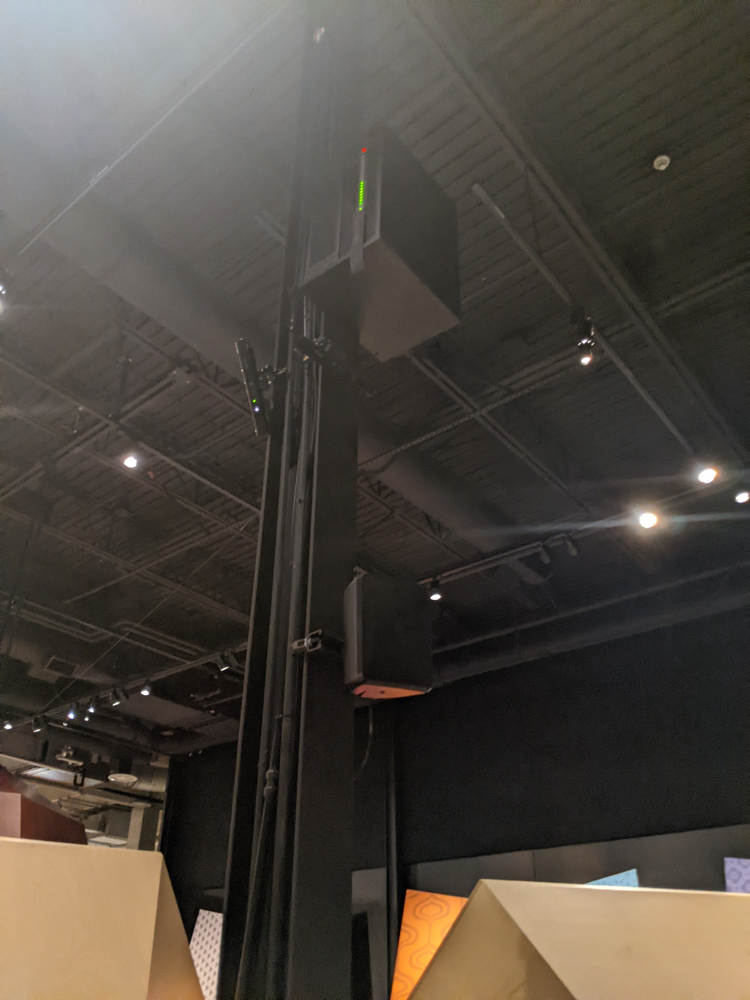

# L'oeuvre :  Horizons

Art sonore interactif

Horizons

Créé par Artificiel
Alexandre Burton

2017

Canada Science and Technology Museum

Ottawa, Ontario, Canada

2 Mars, 2022

Photo prise par : David Weitzenfeld 

Novembre 2021

# Présentation de l'oeuvre détaillée

L'oeuvre est composé de 14 haut-parleurs qui sont géré par un logiciel sur mesure basé sur des technologies open sources.
Les haut-parleurs sont suspendu du plafond a differente hauteur par des tiges de métal noir.

L'oeuvre utilise 4 kinect pour cibler le visiteur et faire jouer des sons different selon l'emplacement.

Il y a plusieurs cible sur le plancher qui déclanche une differente serie de sons pour chaque. Il y a des sons de Nature, des voix, de la musique et aussi des bruits de machine. Tout est présenter avec un effet de surround sound ou comme l'oeuvre le présente : Soundscape (paysage sonore) qui a été inventé par le compisiteur Canadien R. Murrau Schafer en 1977.

Pour l'expérience vécue, il suffi de se positionner sur different endroit et d'écouter les differents sons. Il y a aussi une écran qui explique l'oeuvre avec un bouton pour faire jouer la vidéo expliquative.

L'emplacement ou etais situer l'oeuvre etais vraiment bruyant alors l'immersion n'etais pas la meilleur et j'avais aussi beaucoup de difficulter a entendre les differents bruits.

Pour les liens avec d'autre oeuvre, il y en a deux qui mattire. La première est Chronofrage a cause de comment l'interaction est fait. Les deux oeuvres dépend du visiteur et de ou il est placer. Pour la deuxième oeuvre 

